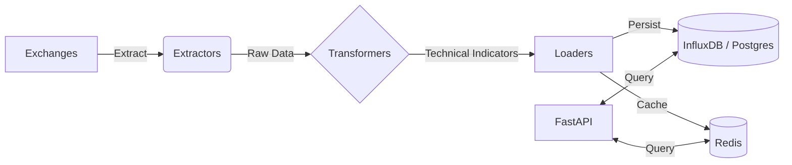

# Project Vortex 🌪️


**Project Vortex** is a high-throughput **Financial Assets ETL (Extract, Transform, Load) Engine** and analytics backend. It aggregates real-time market data from major Crypto, Forex, Stock and Commodity exchanges (Binance, CoinGecko), applies technical analysis transformations, and serves optimized data via a high-performance FastAPI layer.

Designed for scalability and reliability, it employs a sophisticated **Factory-based architecture**, rigorous testing strategies, and a multi-tiered caching system.

## 🏗️ Architecture

The system follows a modular **ETL** pattern:



### Key Components

*   **Core ETL Engine**:
    *   **Extractors**: Modular, factory-generated classes (`BinanceExtractor`, `CoinGeckoExtractor`) that normalize data from disparate APIs.
    *   **Transformers**: Data processing units using **Pandas** and **Pandas-TA** to compute indicators (RSI, MACD, Bollinger Bands) on the fly.
    *   **Loaders**: Abstracted storage interfaces ensuring data integrity across Time-Series (InfluxDB) and Relational (Postgres) stores.
*   **Infrastructure**:
    *   **Caching Strategy**: Implements a **Redis**-backed caching layer to minimize API latency and handle high-concurrency requests.
    *   **Dependency Management**: Managed via **Poetry** for deterministic builds.
    *   **Async I/O**: Leverages `aiohttp` and `asyncio` for non-blocking data ingestion.

## 🛠️ Tech Stack

*   **Language**: Python 3.13
*   **Web Framework**: FastAPI
*   **Data Processing**: Pandas, Pandas-TA
*   **Storage**: Redis (Cache), InfluxDB (Time-Series), PostgreSQL (Metadata)
*   **Testing**: Pytest (Unit & Contract tests)
*   **Containerization**: Docker
*   **Config**: Pydantic Settings

## 🚀 Getting Started

### Prerequisites

*   Python 3.13+
*   Poetry
*   Redis instance

### Installation

1.  **Clone the repository**:
    ```bash
    git clone https://github.com/yourusername/project-vortex.git
    cd project-vortex
    ```

2.  **Install dependencies**:
    ```bash
    poetry install
    ```

3.  **Environment Setup**:
    Copy `.env.example` to `.env` and configure your API keys and database URIs.
    ```bash
    cp .env.example .env
    ```

4.  **Run the Pipeline**:
    ```bash
    poetry run python -m backend.etl.main
    ```

5.  **Start the API Server**:
    ```bash
    poetry run uvicorn backend.api.main:app --reload
    ```

## 🧪 Testing Strategy

Vortex employs a strict testing pyramid:

*   **Unit Tests**: Isolated tests for Transformers and Utilities (mocked external dependencies).
*   **Contract Tests**: Integration tests verifying API schemas against live exchange endpoints to detect breaking 3rd-party changes early.

Run tests via:
```bash
poetry run pytest
```

## 📂 Project Structure

```
backend/
├── api/            # FastAPI endpoints and schemas
├── core/           # Config, Logging, and Base utilities
├── etl/            # The ETL Engine
│   ├── extractors/ # API Clients (Binance, CoinGecko)
│   ├── transformers/ # Data normalization & TA logic
│   └── loaders/    # Database adapters
└── tests/          # Pytest suite
```
